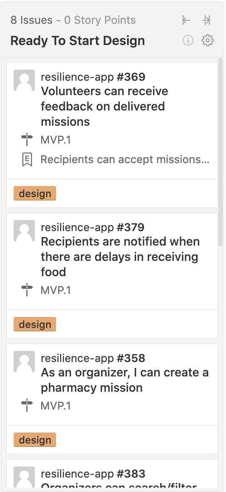
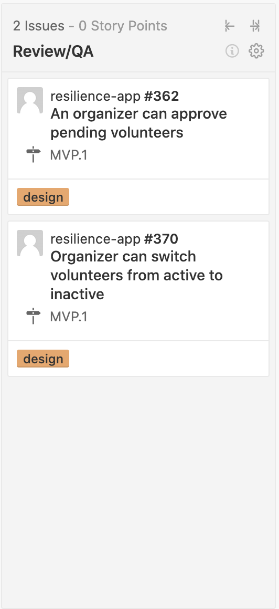

# Process and Workflow


Wait! If you haven't yet, view the [Figma Onboarding Doc](https://www.figma.com/file/GLg0zPNnwMEGIb9TytCrxQ/Resilience-App?node-id=1257%3A553)!


### **Grab a Task** on **ZenHub**

* **Designers** will find issues that are available for pick-up in the **Ready to Start Design** column.  

* When a designer finds an issue that they want to work on they should let @Daniel Huerta, @josh, @Karen Lo, and @Miles know so they can be assigned to the issue and the issue will then be moved to the **In Progress** column.

* To notify the people above you should tag them in a comment one the issue you want to be assigned to \(Interacting with the pull requests and issues will enable you to be assigned\).
  * GitHub handles: @DAHuerta \(Daniel\), @jwu910 \(Josh\), @karenkun \(Karen\), and @utunga \(Miles\).
* Once the designer has completed the assigned issue they should let @Daniel Huerta, @Josh, @Karen Lo, or @Miles know so that the assigned issue can be moved over to the **Review/QA** column.

* We understand that this is a volunteer project and life will sometimes interfere with your schedule.  If for any reason you have to leave the project in the middle of an issue please be courteous to others working on the project let them know via Slack or a comment on the issue.

### **Do the work in Figma**


Make sure you are working in the correct iteration page on Figma.


It will be noted in the [Onboarding & Introductions](https://www.figma.com/file/GLg0zPNnwMEGIb9TytCrxQ/Resilience-App?node-id=1257%3A553) page.

**Note:** _Figma is our source of truth for design. We’re working collaboratively, all over the world and at different times and with different personal processes. If/when you edit a global style or component, take a look to see what else has changed and leave a note in Figma or in Slack to let the team know what’s shifted._ 

### **Have a question?**

Post questions in slack or collect them in Figma. If you get good answers, put them in places in Figma where they will be the most helpful.

### **Approvals for work**

When you have finished a user story, hop over to [\#resilience-app](../) and let everyone know it has been completed and is ready for review.

Check for comments on your design in Figma and also in [\#resilience-app](../) in case you need to make changes.

