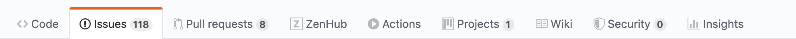
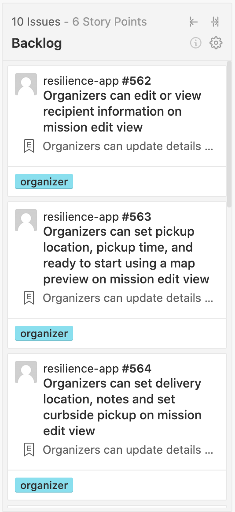
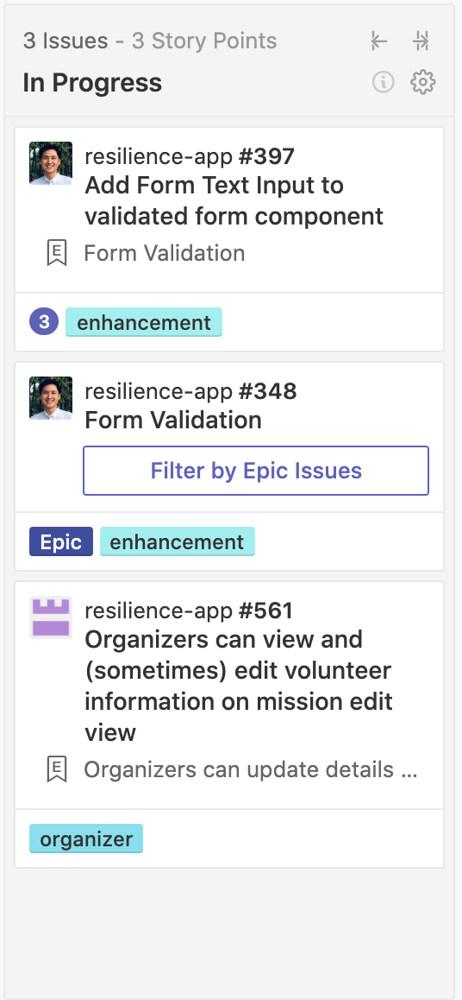
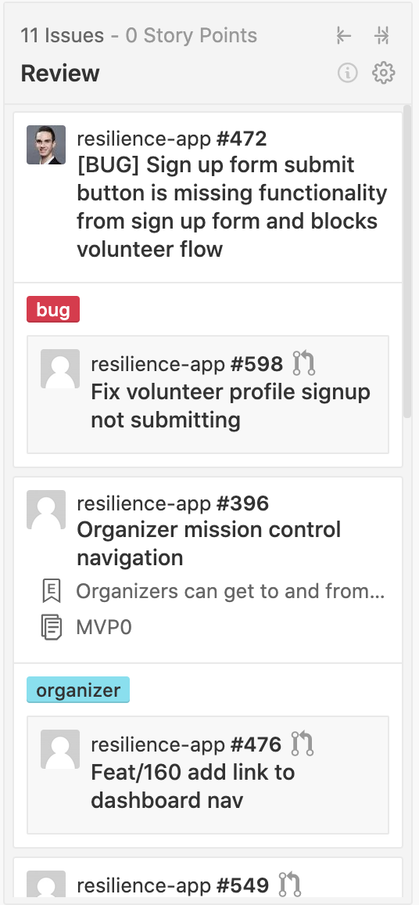

# Getting Started for Developers

Remember, we’re just a group of people volunteering and self-organizing. Leave notes, ask questions, and know that any work at all is appreciated. :-\)

## First. You need access.

**Development Work** happens here: [Resilience App - GitHub](https://github.com/factn/resilience-app)

* Read through the documentation in the homepage README and [CONTRIBUTING](https://github.com/factn/resilience-app/blob/master/CONTRIBUTING.md) to learn how to work with us

  \*Check out the working [demo](https://mutualaid-757f6.web.app/) of the app

  **Second. Check out the process.**

  **For new developer:**

* Please checkout GitHub Issues and if you do not have access to assign yourself to it just yet, just write a comment in the GitHub Issues, and then contact @Miles to get access.
* For new developers GitHub Issues would be a great place to get your feet wet.  Look for GitHub Issues that are labeled "**good first issue**".

**Developer Issues** are on the [**Development**](https://app.zenhub.com/workspaces/development-5ebdc0f6f820682b5eeccf1f/board?repos=248103592) workspace **- Zenhub**

* **Developer tasks** are on the [**Development**](https://app.zenhub.com/workspaces/development-5ebdc0f6f820682b5eeccf1f/board?repos=248103592) ****workspace **-** [Zenhub](https://zenhub.com)
  1. Bookmark the workspace for the [ZenHub Webapp](https://app.zenhub.com/workspaces/design-5ebdb8fd2546980a59dc9577/board?labels=design&repos=248103592)
  2. Install the [ZenHub extension](https://zenhub.com/extension) and see it on GitHub

ZenHub boards are read-only. For write access, inquire on [Slack](https://mutualaidworld.slack.com/archives/C010VC3EN2G)

**Grabbing a Task** from **Development** workspace.

* Developers will find the issues that are available for pick-up in the **Backlog** column. 

* When a developer finds an issue they want to work on they should let @Daniel Huerta, @Josh, @Tuan, @Paul, or @Miles know so you can be assigned to the issue and the issue will then be moved over to the **In Progress** column.

* To notify the people above you should tag them in a comment one the issue you want to be assigned to \(Interacting with the pull requests and issues will enable you to be assigned\).
  * GitHub handles: @DAHuerta \(Daniel\), @jwu910 \(Josh\), @mat10tng \(Tuan\), @qdozaq \(Paul\), and @utunga \(Miles\).
* For new developers Zenhub issues labeled with "**good first issue**" would be a great place to start.
* Once the dev has completed the assigned issue they should let @Daniel Huerta, @Josh, @Tuan, @Paul, or @Miles know so that the assigned issue can be moved over to the **Review** column.

* We understand that this is a volunteer project and life will sometimes interfere with your schedule.  If for any reason you have to leave the project in the middle of an issue please be courteous to others working on the project let them know via Slack or a comment on the issue.

**Questions** about work

* Post questions in Slack! You have great resources in the following channels:
  * **\#resilience-app**
  * **\#resilience-dev**
  * **\#resilience-design**
  * **\#project-management-and-agile**

