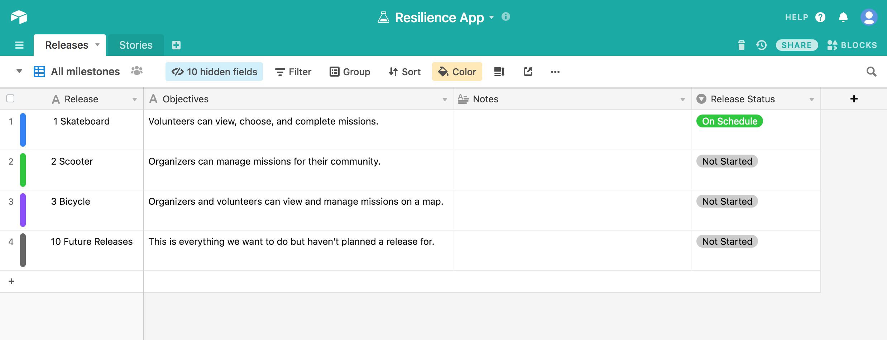
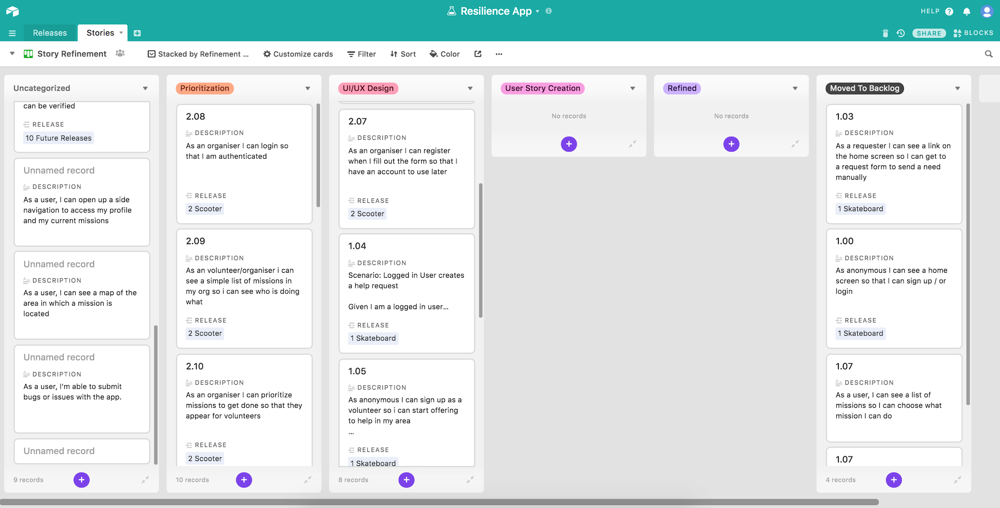
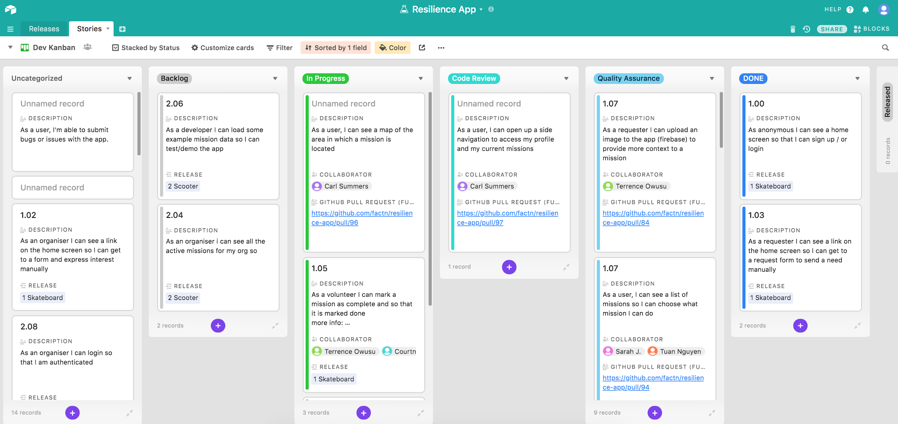

# Project Management

## Getting Access

We us [AirTable](https://airtable.com) for our kanban board and project management overview

[Request access to our kanban board](https://airtable.com/tblRjd2McKgRW9MKj/viwlRRNI0PZIxrGkc?blocks=hide)

## **Overview**

**AirTable is basically a giant spreadsheet with tons of ways to view, sort, and filter the content within it.**

This is where we capture app feedback, create user stories that support the features on the product roadmap, and then design, develop, and release those features in order to continuously improve the app and meet community needs.

## **Releases**

The work we have identified is grouped into releases, based on the complexity of the feature and the priority of its impact.

The first three releases are based on the [Skateboard, Scooter, Bicycle](https://blog.crisp.se/wp-content/uploads/2016/01/Making-sense-of-MVP-.jpg) concept, meaning they are generally sequential; we need to build the skateboard and scooter before we can build the bicycle. We also have a “bucket” for future releases that acts as a sort of backlog.

**Story Refinement Board**

The Story Refinement board is where the work begins. Raw ideas from project contributors and feedback from organizers are entered in the Uncategorized column, where it then gets prioritized, designed, and refined so that it can be developed into a feature.

**Story Refinement Board - Index**

<table>
  <thead>
    <tr>
      <th style="text-align:left"><em>Status Column</em>
      </th>
      <th style="text-align:left"><em>What is it for?</em>
      </th>
      <th style="text-align:left"><em>Who uses it?</em>
      </th>
      <th style="text-align:left"><em>Which fields are required?</em>
      </th>
    </tr>
  </thead>
  <tbody>
    <tr>
      <td style="text-align:left">Uncategorized</td>
      <td style="text-align:left">Issue or feature request is submitted here first, either by organizers
        or people working on the project.</td>
      <td style="text-align:left">Project contributors and organizers can submit feature requests through
        this <a href="https://airtable.com/shr2FTtUiPs5ZT17c">form</a>.</td>
      <td
      style="text-align:left">Description
         Contributor Type
         Issue Type</td>
    </tr>
    <tr>
      <td style="text-align:left">Prioritization</td>
      <td style="text-align:left">Project leads begin refining the submitted ideas. They are generally sized
        for LOE v. impact, and prioritized into releases. Work may also be split
        out into more cards.</td>
      <td style="text-align:left">Product Owner
         Lead Dev
         PM</td>
      <td style="text-align:left">Description
         Contributor Type
         Issue Type
         Story #
         Release
         
      </td>
    </tr>
    <tr>
      <td style="text-align:left">UI/UX Design</td>
      <td style="text-align:left">User stories are wireframed and designed, in close collaboration with
        developers.</td>
      <td style="text-align:left">UX/UI/designers</td>
      <td style="text-align:left">
        
Description
           Contributor Type
           Issue Type
           Story #
           Release
           Collaborator

        
Link to Figma?
           
        

      </td>
    </tr>
    <tr>
      <td style="text-align:left">User Story Creation</td>
      <td style="text-align:left">Designs are reviewed by project leads, and further broken cards for development
        (if needed)</td>
      <td style="text-align:left">Product Owner
         Lead Dev
         PM</td>
      <td style="text-align:left">Description
         Story #
         Release</td>
    </tr>
    <tr>
      <td style="text-align:left">Refined</td>
      <td style="text-align:left">Dev-ready cards aggregate in this column until ready for a new release
        of work.</td>
      <td style="text-align:left">Product Owner
         Lead Dev
         PM</td>
      <td style="text-align:left">Description
         Story #
         Release</td>
    </tr>
    <tr>
      <td style="text-align:left">Moved to Backlog</td>
      <td style="text-align:left">Once refined cards are moved to the Dev Kanban board, they still appear
        in this column.</td>
      <td style="text-align:left">No one, really. It&#x2019;s automatically populated.</td>
      <td style="text-align:left"></td>
    </tr>
  </tbody>
</table>## **Dev Kanban Board**

The Dev Kanban board is where we track development work in progress, including review, QA testing, and merging into the GitHub repo.

**Dev Kanban Board - Index**

<table>
  <thead>
    <tr>
      <th style="text-align:left"><em>Status Column</em>
      </th>
      <th style="text-align:left"><em>What is it for?</em>
      </th>
      <th style="text-align:left"><em>Who uses it?</em>
      </th>
      <th style="text-align:left"><em>Which fields are required?</em>
      </th>
    </tr>
  </thead>
  <tbody>
    <tr>
      <td style="text-align:left">Uncategorized</td>
      <td style="text-align:left">Duplicates Uncategorized column on the Story Refinement board</td>
      <td
      style="text-align:left">Nobody</td>
        <td style="text-align:left">None</td>
    </tr>
    <tr>
      <td style="text-align:left">Backlog</td>
      <td style="text-align:left">Work can be picked up from this column by any developer on the project.
        It should be addressed according to the priority of the release (ie, Skateboard
        before Scooter)</td>
      <td style="text-align:left">Developers</td>
      <td style="text-align:left">Description
         Issue Type
         Story #
         Release</td>
    </tr>
    <tr>
      <td style="text-align:left">In Progress</td>
      <td style="text-align:left">Work is picked up from Backlog, the developer assigns it to themself as
        &#x201C;Collaborator&#x201D; and moves it to this column.</td>
      <td style="text-align:left">Developers</td>
      <td style="text-align:left">Description
         Issue Type
         Story #
         Release
         Collaborator
         GitHub Issue (<em>if available</em>)</td>
    </tr>
    <tr>
      <td style="text-align:left">Code Review</td>
      <td style="text-align:left">Once work has been developed to meet the criteria specified on the card,
        the developer should create a pull request in GitHub to merge the work,
        add a link to the card and flip it to this column. The Product Owner and/or
        lead dev will review the work prior to QA.</td>
      <td style="text-align:left">
        
Product Owner
           Lead Dev

        
Developers

      </td>
      <td style="text-align:left">
        
Description
           Issue Type
           Story #
           Release
           Collaborator
           GitHub Issue (<em>if available</em>)

        
GitHub Pull Request

      </td>
    </tr>
    <tr>
      <td style="text-align:left">Quality Assurance</td>
      <td style="text-align:left">Work that passes Code Review gets flipped to this column for visual checks
        and testing functionality. QA may log additional issues in GItHub if bugs
        are discovered, and those should be linked to the card as well.</td>
      <td
      style="text-align:left">
        
Product Owner
           Lead Dev

        
QA&#x2019;s

        </td>
        <td style="text-align:left">
          
Description
             Issue Type
             Story #
             Release
             Collaborator
             GitHub Issue (<em>if available</em>)

          
GitHub Pull Request

        </td>
    </tr>
    <tr>
      <td style="text-align:left">Done</td>
      <td style="text-align:left">Work that passes QA gets flipped to Done while awaiting any other work
        that needs to accompany it as part of an overall product release.</td>
      <td
      style="text-align:left">
        
Product Owner
           Lead Dev

        
QA&#x2019;s

        </td>
        <td style="text-align:left">
          
Description
             Issue Type
             Story #
             Release
             Collaborator
             GitHub Issue (<em>if available</em>)

          
GitHub Pull Request

        </td>
    </tr>
    <tr>
      <td style="text-align:left">Released</td>
      <td style="text-align:left">Completed work is grouped and released according to the product roadmap.</td>
      <td
      style="text-align:left">Product Owner</td>
        <td style="text-align:left"></td>
    </tr>
    <tr>
      <td style="text-align:left">Won&#x2019;t Do</td>
      <td style="text-align:left">Contains work that we won&#x2019;t complete, due to changing priorities
        or needs of the end-user</td>
      <td style="text-align:left">Product Owner</td>
      <td style="text-align:left"></td>
    </tr>
  </tbody>
</table>